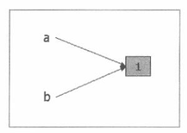
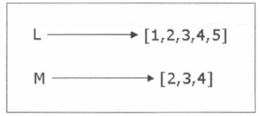
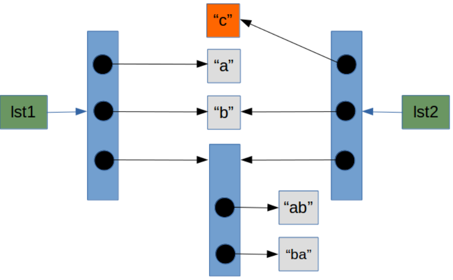

## 8. 객체의 복사 및 형 변환
### 01. 객체의 복사
#### 복사의 종류 및 의미
|       종류       | 의미                                           | 결과                               |
|:----------------:|------------------------------------------------|------------------------------------|
| 레퍼런스 복사    | 객체를 참조하는 주소만 복사                    | 원본 변경 시, 참조하는 객체에 영향 |
| 실제 객체의 복사 | 값을 가지는 객체를 하나 혹은 그 이상 만드는 것 |                                   |

#### 1-1. copy 모듈을 이용한 객체 복사
|           종류          | 의미                                               | 비고                 |
|:-----------------------:|----------------------------------------------------|----------------------|
| 얕은 복사(Shallow Copy) | 복합 객체를 별도로 생성하되 참조주소 공유         | 내용이 a = b 와 동일 |
| 깊은 복사(Deep Copy)    | 내부에 객체들까지 모두 새롭게 복사                |                      |

~~~
s = [1, 2, 3, 4, 5]
t = s[1:4]
print(id(s), id(t))

s[2] = 100
print(s, t)
~~~

- 위 코드는 문제 없이 동작한다.
- 하지만, 아래와 같이 2중 이상의 list, 즉, list 안에 list 가 있는 경우, 예상과 다른 결과가 나타난다.
~~~
s = [[1, 2, 3], [4, 5, 6]]
t = s[:] # copy.copy(s)

d = {
    id(s): id(t),
    id(s[0]): id(t[0]),
    id(s[0][0]): id(t[0][0])
}

print(d)

s[0] = 100
print(s, t)

# s[0][0] = 100
# print(s, t)

# s.append([7, 8, 9])
# print(s, t)
~~~

### 02. 형 변환
#### 2-1. 수치 형 변환
1. 정수형 변환
|   내장함수   | 반환값                                                        | 비고                                  |
|:------------:|---------------------------------------------------------------|---------------------------------------|
| int()        | 정수                                                          |                                       |
| round()      | 반올림한 정수                                                 | 실수 출력 방법 round(숫자, 숫자 길이) |
| math.floor() | 주어진 인수보다 작거나 같은 수 중에서 가장 큰 정수형의 정수   |                                       |
| math.ceil()  | 주어진 실수보다 크거나 같은 수 중에서 가장 작은 정수형의 정수 |                                       |

2. 실수 형 변환
- float()

3. 복소수로의 형 변환
- complex(1, 3)

#### 2-2. 시퀀스 자료형 변환
| 내장함수 | 역할          |
|:--------:|---------------|
| list()   | 리스트로 변환 |
| tuple()  | 튜플로 변환   |

#### 2-3. 문자열로의 형 변환
| 내장함수 | 역할              | 비고       |
|:--------:|-------------------|------------|
| str()    | 문자열로 변환     |            |
| repr()   | 문자열로 변환     |            |
| `obj`    | repr(obj) 와 동일 | 실행 안 됨 |

- 책에는 str(), repr() 과의 차이점이 유효자리라고 작성되어있는데, 현재 버전에서는 동일하게 출력됨
- [참고: str() 과 repr() 의 차이](http://pinocc.tistory.com/168)

##### list 혹은 tuple 형태의 문자열을 해당 객체로 변경하고 싶은 경우, eval() 함수를 이용한다.
##### eval(): 문자열로 된 표현식을 실행하는 내장 함수
##### 객체 > 문자열 > 객체: repr(), eval() 을 이용하여 구현 (str은 완벽한 변환을 못할 때가 있음)

#### 2-4. 문자열 요소를 가지는 리스트나 튜플을 문자열로 변환
- join()

#### 2-5. 리스트, 튜플과 사전의 변환
1. 사전에서 리스트로 변환
- keys(), values(), items()

2. 리스트에서 사전으로 변환
|        내장함수        | 역할           |
|:----------------------:|----------------|
| zip(key, values)       | 두 객체 합체   |
| dict(zip(key, values)) | 사전 객체 생성 |

#### 2-6. 문자 변환
- ASCII 코드 변환
| 내장함수 | 역할               |
|:--------:|--------------------|
| chr(num) | 아스키 코드 > 문자 |
| ord(c)   | 문자 > 아스키 코드 |

#### 2-7. 임의의 진수를 10진수로 변환
1. 10진수 > 8, 16진수
| 내장함수 | 역할          |
|:--------:|---------------|
| hex(num) | 16진수로 변환 |
| oct(num) | 8진수로 변환  |

2. 10진수 > 2진수
- 내장 함수 없음, 책의 예제 참조

3. 10진수 > 임의의 진수
- 책의 예제 참조

#### 2-9. 정수를 콤마가 있는 문자열로 변환
- locale 모듈: 나라마다 문화적으로 표현이 다른 것들을 처리할 수 있음

~~~
[천 단위 콤마]

import locale
locale.setlocale(locale.LC_ALL, "")
print(locale.format("%d", 10030405, 1)) # 10,030,405
~~~

## 9. 파일
### 내장함수
|     내장함수     | 역할           | 비고                |
|:----------------:|----------------|---------------------|
| open()           | 파일 객체 얻기 |                     |
| read() / write() | 읽기 / 쓰기    |                     |
| close()          | 객체 사용 종료 | 자동으로 사라짐(gc) |

### 1. 파일 쓰기
#### file.write(string)
- return: 작성된 문자열의 갯수

### 2. 파일 읽기
#### open(filename, mode)
#### file(filename, mode)
##### mode (뒷장에 자세히 나옴)
| 모드 | 의미           |
|:----:|----------------|
| r    | 읽기(기본값)   |
| w    | 쓰기           |
| a    | 객체 사용 종료 |
| r+   | 읽기 / 쓰기    |
| b    | 바이너리 모드  |

### 3. 라인 단위로 파일 읽기
|   내장함수   | 역할                                         | 비고                                                    |
|:------------:|----------------------------------------------|---------------------------------------------------------|
| readline()   | 한 번에 한 줄씩                              | 주로 while문과 이용                                     |
| readlines()  | 파일 전체를 라인 단위로 끊어서 리스트에 저장 |                                                         |
| xreadlines() | readlines()와 유사                           | python3 없어짐 for line in a_file 형태로 사용할 수 있음 |