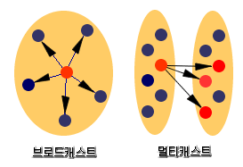
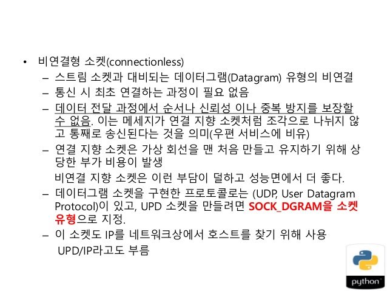

## 17. 소켓 프로그래밍

### 09. 멀티캐스팅
- 멀티캐스팅이란, 하나 또는 여러 네트워크에 속한 선별된 개체와 통신하는 모델을 말한다.
- 브로드캐스팅은 하나의 네트워크 그룹에 속한 모든 개체와 통신하는 데 반해, 멀티캐스팅은 하나의 네트워크 그룹에 속해 있어도 선별적인 그룹의 개체와 통신할 수 있고, 또한 여러 네트워크에 걸쳐 이러한 개체가 분산되어 있을 수도 있다.

- 멀티캐스팅을 위한 IP주소 범위는 224.0.0.0 ~ 239.255.255.255(1110으로 시작하는 주소 범위)이며, UDP 통신을 한다.

- 메시지 송신 측은 그룹으로 메시지를 보내며, 그룹에 속한 호스트는 그 메시지를 받는다.
- 멀티캐스트 데이터를 받으려면 반드시 그룹에 가입해야 하지만, 데이터를 보내기 위해서는 그룹에 가입할 필요가 없다.
- 그룹의 가입과 탈퇴는 자유롭고, 그룹 구성원 모두 동등한 자격을 가지고 있다.
- 기본적으로는 하나의 네트워크 그룹에서 멀티캐스팅이 동작하지만 멀티캐스터 라우터를 설정하면 다른 네트워크로도 똑같이 패킷을 전송할 수 있다.
- 멀티캐스트 전송을 위해서는 헤더에 수신자의 주소 대신 수신자들이 참여하고 있는 그룹 주소를 표시하여 패킷을 전송한다.

- 그룹에 가입하는 것은 소켓 옵션 s.setsockopt(IPPROTO_IP, IP_ADD_MEMBERSHIP, 그룹주소) 을 설정하는 것인데, 실제 코드는 다음과 같다.

~~~
from socket import *
import struct

def dottedQuadtoNum(ip):
    "convert decimal dotted quad string to long interger"
    return struct.unpack('>L', inet_aton(ip))[0]

ip = '235.5.5.5' # 그룹 주소
mreq = struct.pack('11', htonl(dottedQuadtoNum(ip)), INADDR_ANY)
s.setsockopt(IPPROTO_IP, IP_ADD_MEMBERSHIP, mreq) # 그룹에 가입
~~~

- 탈퇴는 다음과 같다.

~~~
s.setsockopt(IPPROTO_IP, IP_DROP_MEMBERSHIP, mreq)
~~~

- 멀티캐스트 라우터를 이용해서 UDP 패킷을 전송할 때 TTL 값을 설정해 주어야 한다.
- TTL은 Time To Live의 약어로, 몇 단계까지의 라우터를 거칠 때까지 패킷이 손실되지 않고 전달되도록 할 것인지에 대한 설정이다.
- 라우터는 패킷을 통과시킬 때마다 TTL 값을 하나씩 감소시키며 결국 TTL은 0이 되면 더 이상 라우터를 통과하지 못하는 것이다.
- 즉, TTL이 0이라면 같은 네트워크 안에서만 패킷이 흐를 것이며 1 이상이어야 다른 네트워크로 전달될 수 있으며 멀티캐스트에서는 보통 32라면 같은 소속 기관 내의 네트워크에, 255라면 보통 전세계 네트워크를 뜻한다.
- 송신 측 프로그램은 다음과 같이 TTL 값을 설정한다.

~~~
from socket import *
s = socket(AF_INET, SOCK_DGRAM)
s.setsockopt(IPPROTO_IP, IP_MULTICAST_TTL, 4) # 멀티캐스트 TTL 설정
s.sendto('Multicasting OK!!!'.encode('utf-8'), ('235.5.5.5', 9000))
~~~

- 기본적으로 자신이 보낸 데이터를 자신도 받게 되어 있는데, 이것을 변경하려면 다음과 같은 소켓 옵션을 메시지를 보내기 전에 추가해야한다.

~~~
s.setsockopt(IPPROTO_IP, IP_MULTICAST_LOOP, 0) # 루푸백 DISABLE
~~~

[참고] IPv6 처리를 하려면, IPv6 용 소켓을 생성하면 된다.

~~~
from socket import *
s = socket(AF_INET6, SOCK_STREAM)
~~~

### 10. 기타 유용한 socket 함수들
|      함수     |                       설명                       |
|:-------------:|:------------------------------------------------:|
| getservbyname | 포트 번호 반환                                   |
| getsockname   | 내 컴퓨터 주소와 포트 번호 반환                  |
| getpeername   | 서버 주소와 포트 번호 반환                       |
| getaddrinfo   | host의 port에 관한 정보 반환                     |
| gethostbyname | 호스트 이름을 IPv4 형식의 주소로 반환            |
| gethostname   | 파이썬을 실행하고 있는 호스트 컴퓨터의 이름 반환 |
| getfqdn       | 전체 도메인 이름 반환                            |
| makefile      | 소켓을 마치 파일처럼 다루게 해 주는 객체를 생성  |

### 11. FTP 클라이언트
- FTP(File Transfer Protocol) 프로토콜 클라이언트는 새로 구현할 필요가 없다.
- ftplib 모듈이 FTP 클래스를 지원하며 이것은 클라이언트 측의 FTP 프로토콜을 구현한다.
- 이 클래스를 다른 FTP 사이트의 미러링과 같은 자동화된 FTP 작업을 수행하기 위해 사용할 수 있다.
- FTP는 기본 포트 21/20을 사용하는 이중 채널 프로토콜이다.
- 서버의 21번 포트는 제어 연결로서 제어 정보를 전달하는 데 사용되고
- 20번 포트는 데이터를 교환하는 데 사용된다.
- ftplib는 기본적으로 패시브(Passive) 모드로 동작한다. ([참고]https://extrememanual.net/3504)
- 즉, 서버가 데이터 포트를 먼저 열고, 데이터 포트 정보를 제어 연결 포트를 통해 전달하면 클라이언트가 포트로 접속하는 방식이다.

|                         메서드                        |                          설명                         |
|:-----------------------------------------------------:|:-----------------------------------------------------:|
| FTP([host[, user[, password[, acct]]]])               | 객체 생성                                             |
| connect(host[, port])                                 | 연결                                                  |
| login([user[, password[, acct]]])                     | 로그인                                                |
| close()                                               | 연결 종료                                             |
| dir[argument[, ...]])                                 | 파일 목록 얻기(LIST)                                  |
| nlst([argument[, ...]])                               | 파일 목록 얻기(NLST)                                  |
| retrlines(command[, callback])                        | ASCII 모드로 파일 다운로드                            |
| retrbinary(command, callback[, maxblocksize[, rest]]) | 이진 파일 다운로드                                    |
| storlines(command, file)                              | ASCII 모드로 파일 저장                                |
| storbinary(command, file[, blocksize])                | 이진 모드로 파일 저장                                 |
| abort()                                               | 전송 중지                                             |
| size(filename)                                        | filename의 크기 반환                                  |
| rename(fromname, toname)                              | 파일 이름 변경                                        |
| delete(filename)                                      | 파일 삭제                                             |
| pwd()                                                 | 현재 디렉토리 반환                                    |
| cwd(pathname)                                         | 현재 디렉토리 설정                                    |
| mkd(pathname)                                         | 디렉토리 생성                                         |
| rmd(dirname)                                          | 디렉토리 삭제                                         |
| set_pasv(boolean)                                     | passive 모드 설정                                     |
| sendcmd(command)                                      | 임의의 단순한 명령을 서버로 전송, 응답문자열을 받는다 |
| voidcmd(command)                                      | 임의의 단순한 명령을 서버로 전송, 응답 코드를 처리    |

### 12. Telnet 클라이언트
파이썬은 표준 라이브러리로 telnetlib 모듈에 Telnet 프로토콜을 구현하는 Telnet 클래스를 지원한다.

#### 12-1. 텙넷 객체 메서드
